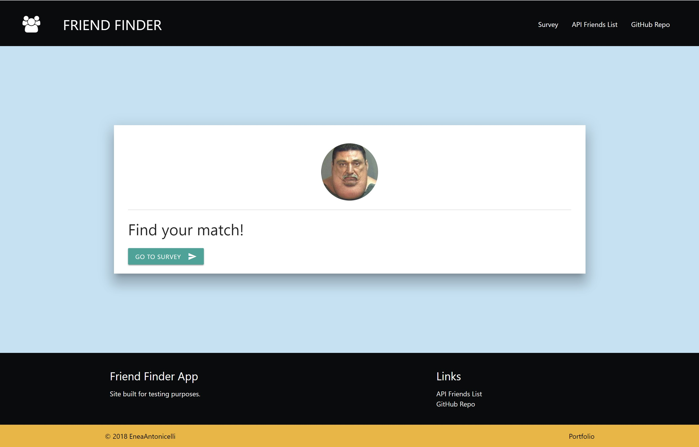
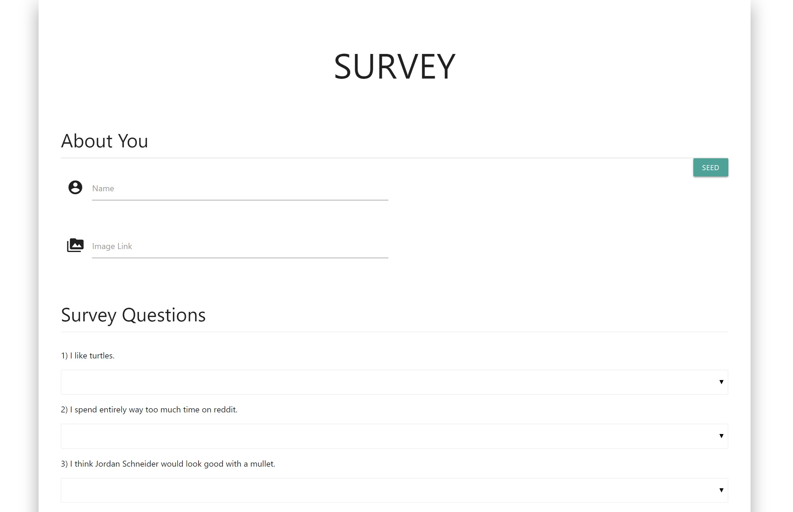

# FriendFinder

UC Davis Coding BootCamp - Week 13 

The application takes user input in the form of a survey. It requires the user to input their name, a link to the image they would like to use, and an answer to 10 questions.The app will then display the name and picture of the user with the best overall match.

Please feel free to preview the site here:
https://intense-thicket-62994.herokuapp.com/

# Getting Started
To get started on this project, follow the installations instructions below.

Fork the repo.

Ensure Node.js is installed on your computer.
Navigate to the working directory and do the following in your terminal

###### Step 1
> npm install

The above command will install all dependencies needed for this project to run.

###### Step 2
> npm install -g nodemon

The above command will install nodemon globally for you
nodemon will watch the files in the directory in which nodemon was started, and if any files change, nodemon will automatically restart your node application. The benefit to using nodemon over node.js is that you do not need to continuously re-run the server followed by a refresh of your browser.
Nodemon does this on the fly.

###### Step 4
> nodemon server.js
> 
The above command will start the server for you

###### Step 5
> Open your browser to http://localhost:8080/

If you see "listening on PORT 8080" in your CLI, then you're good to go :thumbsup:!

Have fun!

Built With
* Node.JS
* Express
* JavaScript
* JQuery
* Materialize
* Chosen
* HTML
* CSS

Author
* Enea Antonicelli